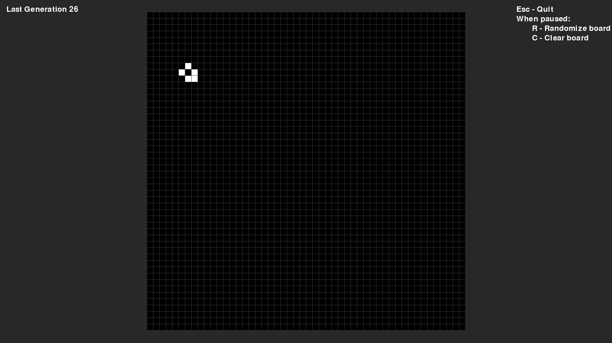
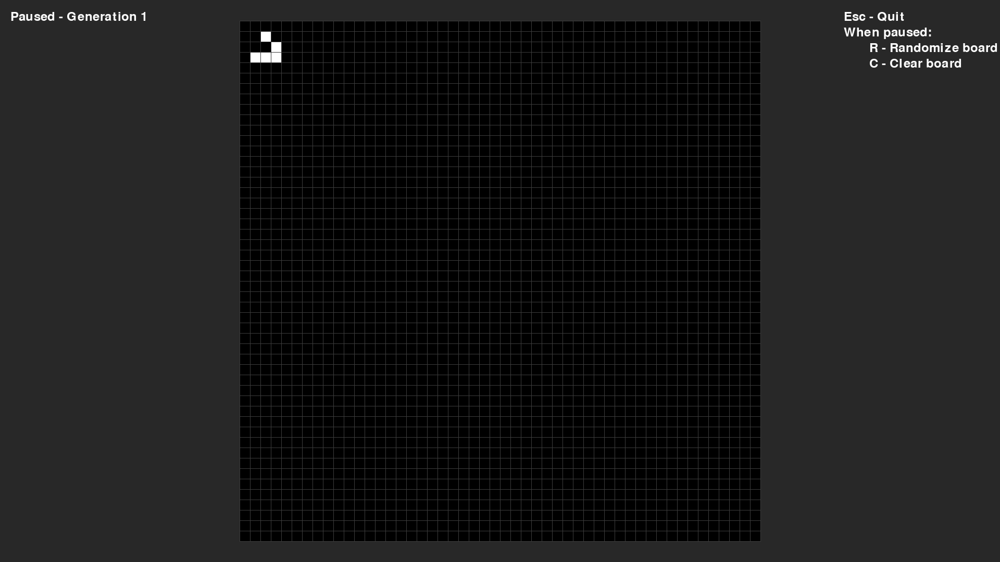

# Conway's Game of Life (Pygame)

A full-featured, interactive, and visually clean implementation of Conway’s Game of Life using Python and Pygame.

---

## 🔮 Features

- 🧠 **Cellular Automation**: Based on Conway's classic rules.
- 🖱️ **Click-to-Toggle**: Edit the grid with your mouse.
- ⏸️ **Pause & Resume**: Use `Space` to control simulation.
- 🎲 **Randomize/Clear**: Press `R` or `C` while paused.
- 📺 **Fullscreen Adaptive**: Automatically scales and centers the board.
- 🆘 **In-App Help Panel**: Shows active controls on the right.

---

## 🎮 Controls

| Key / Action   | Function                  |
|----------------|---------------------------|
| `Space`        | Pause / Resume            |
| `R` (Paused)   | Randomize board           |
| `C` (Paused)   | Clear board               |
| `Mouse Click`  | Toggle cell (when paused) |
| `Esc`          | Exit the game             |

---

## 🛠️ Requirements

- Python 3.7+
- Pygame

Install using:

```bash
pip install pygame
```
---
## 📦 Running the Game

```python main.py```

Make sure board.py and rules.py are in the same directory as main.py.

---
## 💡 Future Ideas

    Save/load patterns

    Adjustable speed

    Pattern presets (e.g., glider, pulsar)

    Grid resizing
---
## 📸 Screenshot


---

## 👨‍💻 Author

Developed by **Anas Arfeen**
Powered by Python 🐍 + Pygame 🎮


---
