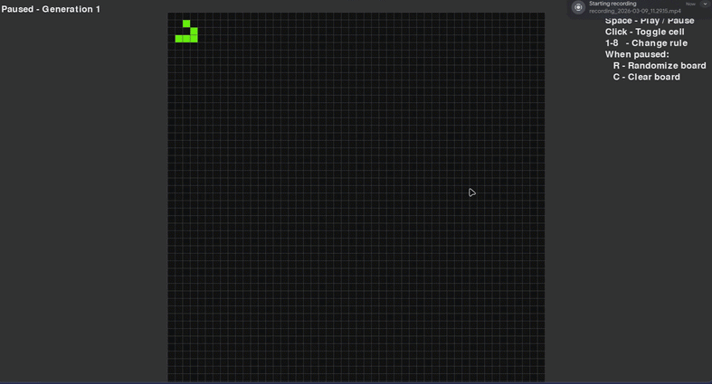
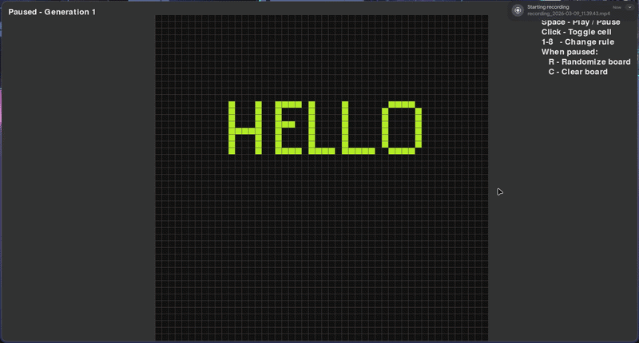
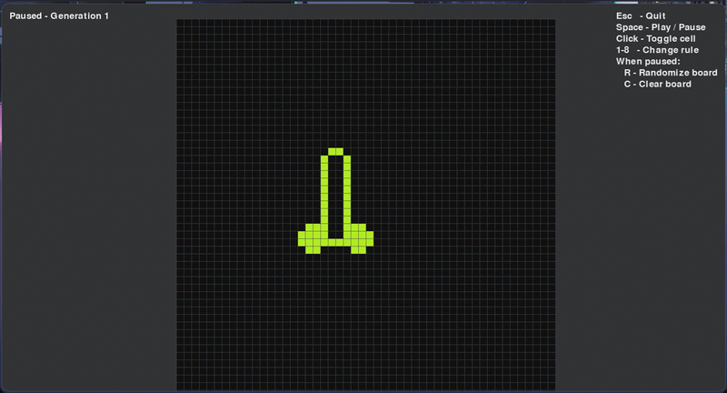
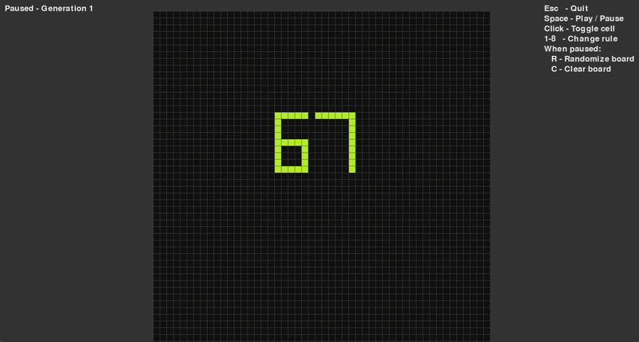
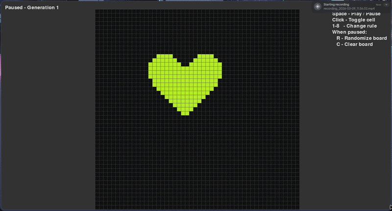
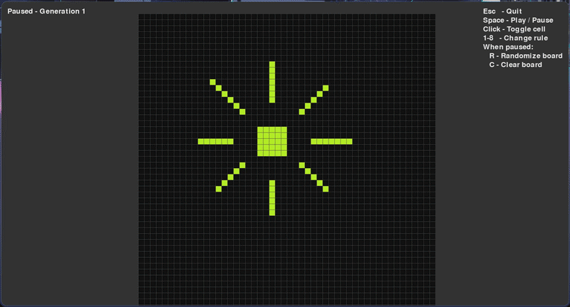
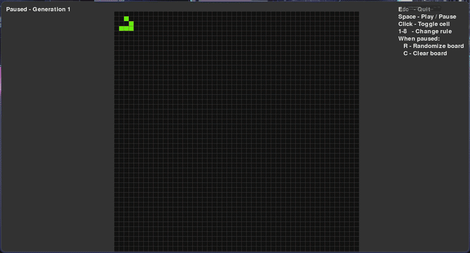
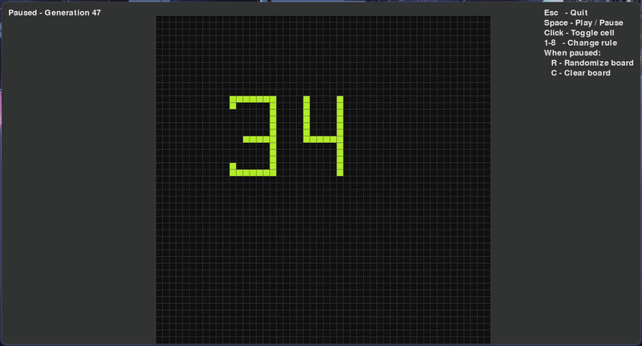

# Convoy: Advanced Game of Life Engine

A visually polished and feature-rich implementation of Conway’s Game of Life and other cellular automata rules, developed in Python using the Pygame framework.


---

## ✨ Unique Features

- **Multiple Rule Sets**: Switch between 8 different cellular automata behaviors (Maze, HighLife, Replicator, etc.) in real-time.
- **Adaptive Aging System**: Cells change color dynamically based on their lifespan, transitioning from vibrant greens to deep reds as they survive.
- **Fullscreen Experience**: Automatically detects system resolution for an immersive, centered simulation.
- **Interactive Editing**: Pause the simulation at any time to manually toggle cells, randomize the board, or clear the grid.

---

## 🎮 Controls

Navigate the simulation using the following keyboard and mouse commands:

| Command | Action |
| :--- | :--- |
| `Space` | **Pause / Resume** simulation |
| `1 - 8` | **Switch Rules** (e.g., 1: GOL, 6: Maze, 7: Replicator) |
| `Mouse Click` | **Toggle Cell** state (available while paused) |
| `R` | **Randomize** board with 100 random cells (while paused) |
| `C` | **Clear** entire board (while paused) |
| `Esc` | **Quit** game |

---

## 🧬 Supported Rules

Explore different mathematical universes by pressing keys `1` through `8`:

1. **Classic GOL**: The standard Conway rules.
2. **HighLife**: Similar to GOL but with B36/S23.
3. **Day & Night**: A symmetric rule where dead and live cells behave similarly.
4. **Seed**: Every live cell dies, but new ones are born from 2 neighbors.
5. **Life Without Death**: Cells never die; they only spread.
6. **Maze**: Generates complex, maze-like corridors.
7. **Replicator**: Every pattern eventually replicates itself.
8. **34**: Patterns stabilize into unique "34" blocks.

---

## 🚀 Getting Started

### Prerequisites

- Python 3.7 or higher
- NumPy
- Pygame

### Installation

1. Clone the repository or download the source files.
2. Install the required dependencies:
   
   ```bash
   pip install pygame numpy
   ```

### Running the Simulation

Launch the engine by running main.py:

   ```bash
   python main.py
   ```

---

## 📂 Project Structure

- `main.py`: The primary entry point containing the game loop and aging logic.

- `rules.py`: Dictionary of rule sets and the logic for generation updates.

- `board.py`: Utilities for grid construction, neighbor counting, and randomization.

- `gui.py`: Lightweight version of the interface focused on basic visualization.

---

## 📸 Screenshots

**Game Of Life:**


**HighLife:**


**DaynNight:**


**Seed:**


**Life Without Death:**


**Maze:**


**Replicator:**


**34:**



---
Developed by **Anas Arfeen!**
